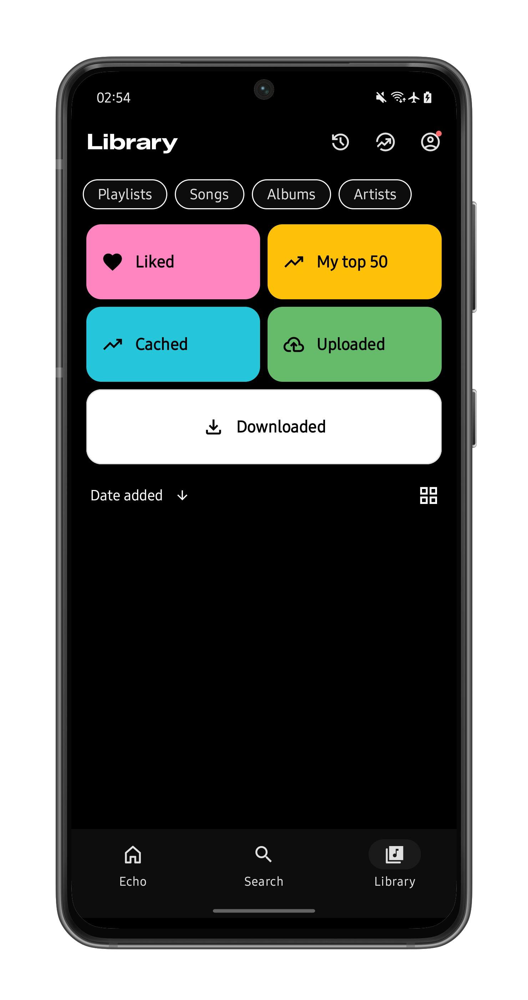

<div align="center">
  
</div>

<div align="center">
  <h1>Echo Music</h1>
  <h3>A modern, feature-rich music streaming app for Android</h3>
  <p>Stream music from YouTube Music and Spotify with advanced features like AI song suggestions, synced lyrics, bit-perfect USB DAC support, and offline playback.</p>
  <p><strong>Current Version: v1.6.2</strong></p>
</div>

<div align="center">
  <a href="https://github.com/iad1tya/Echo-Music">
    
  </a>
  <a href="https://github.com/iad1tya/Echo-Music">
    
  </a>
  <a href="https://github.com/iad1tya/Echo-Music/issues">
    
  </a>
  <a href="https://github.com/iad1tya/Echo-Music/blob/main/LICENSE">
    
  </a>
  <a href="https://github.com/iad1tya/Echo-Music/releases">
    
  </a>
</div>

<div align="center">
  <a href="https://github.com/iad1tya/Echo-Music/releases/latest">
    
  </a>
  <a href="https://github.com/iad1tya/Echo-Music/discussions">
    
  </a>
  <a href="https://discord.gg/eNFNHaWN97">
    
  </a>
</div>

## 📱 Screenshots

<div align="center">
  
  
  
  
</div>

## 📋 Table of Contents

- [Features](#-features)
- [Quick Start](#-quick-start)
- [Installation](#-installation)
- [Configuration](#-configuration)
- [Architecture](#-architecture)
- [Running the App](#-running-the-app)
- [Contributing](#-contributing)
- [License](#-license)
- [Privacy](#-privacy)
- [Support](#-support)
- [Credits](#-credits)

## ✨ Features

### 🎵 Music Streaming
- **YouTube Music Integration**: Stream music from YouTube Music and YouTube for free, without ads
- **Spotify Integration**: Access Spotify's vast music library with Canvas support
- **Background Playback**: Continue listening while using other apps
- **High-Quality Audio**: Support for various audio formats and quality settings
- **Bit Perfect Playback**: USB DAC support for audiophile-grade audio output
- **Offline Playback**: Download music for offline listening

### 🎨 User Experience
- **Modern UI**: Built with Jetpack Compose and Material Design 3
- **Dark Theme**: Beautiful dark mode interface with Material You support
- **Multi-language Support**: Available in 20+ languages
- **Welcome Flow**: Personalized onboarding experience with user name setup
- **Customizable Interface**: Adjustable themes and layouts

### 🔍 Discovery & Search
- **Smart Search**: Search everything on YouTube and Spotify
- **AI Song Suggestions**: Get personalized music recommendations
- **Browse Categories**: Explore Home, Charts, Podcasts, Moods & Genres
- **Trending Content**: Stay updated with the latest music trends
- **Recently Played**: Quick access to your recent music
- **Quick Access**: Recently played, most played, and downloads

### 🎯 Advanced Features
- **Synced Lyrics**: Real-time lyrics from multiple sources (LRCLIB, Spotify, YouTube Transcript)
- **Smart Lyrics Defaults**: Automatic lyrics provider selection based on content type
- **Playlist Management**: Create, edit, and sync custom playlists
- **Sleep Timer**: Set automatic sleep timer for bedtime listening
- **Android Auto Support**: Seamless integration with Android Auto
- **Widget Support**: Home screen widget for quick access
- **Artist Notifications**: Get notifications from followed artists

### 🎧 Audiophile Features
- **Bit Perfect Playback**: USB DAC support for uncompressed audio output
- **USB DAC Detection**: Automatic detection of connected USB audio devices
- **Device Compatibility**: Smart detection of DAC-compatible devices
- **Audio Processing Control**: Disable audio processing for pure bit-perfect output
- **High-Resolution Audio**: Support for high-quality audio formats

### 🔧 Technical Features
- **SponsorBlock Integration**: Skip sponsored content automatically
- **1080p Video Support**: High-quality video playback with subtitles
- **Multi-Account Support**: Support for multiple YouTube accounts
- **FFmpeg Integration**: Advanced audio/video processing capabilities
- **Caching System**: Intelligent caching for faster loading and offline support
- **Privacy Controls**: User-controlled analytics and crash reporting
- **Performance Optimizations**: Smooth animations and jitter-free scrolling
- **Firebase Analytics**: Comprehensive usage analytics and crash reporting
- **USB DAC Detection**: Automatic detection and configuration for USB audio devices

## 🚀 Quick Start

### Prerequisites
- **Android Studio**: Arctic Fox (2020.3.1) or later
- **Android SDK**: API level 26 (Android 8.0) or later
- **Kotlin**: 2.2.10 or later
- **Java**: JDK 17 or later
- **Git**: For version control

### 📱 Installation

#### Option 1: Download Pre-built APK
1. Go to [Releases](https://github.com/iad1tya/Echo-Music/releases/latest)
2. Download the latest APK file
3. Install on your Android device
4. Enable "Install from Unknown Sources" if needed

#### Option 2: Build from Source
1. **Clone the repository**
   ```bash
   git clone https://github.com/iad1tya/Echo-Music.git
   cd Echo-Music
   ```

2. **Configure Android SDK**
   ```bash
   cp local.properties.template local.properties
   ```
   Edit `local.properties` and set your Android SDK path:
   ```properties
   sdk.dir=/path/to/your/android/sdk
   ```

3. **Configure Firebase (Required for Analytics & Crashlytics)**
   
   **For Main App:**
   ```bash
   cp app/google-services.json.template app/google-services.json
   ```
   
   **For Debug Build:**
   ```bash
   cp app/src/foss/debug/google-services.json.template app/src/foss/debug/google-services.json
   ```
   
   **For Full Release Build:**
   ```bash
   cp app/src/full/release/google-services.json.template app/src/full/release/google-services.json
   ```
   
   Replace placeholder values in these files with your Firebase project details:
   - `YOUR_PROJECT_NUMBER`: Your Firebase project number
   - `your-firebase-project-id`: Your Firebase project ID  
   - `YOUR_MOBILE_SDK_APP_ID`: Your Firebase mobile SDK app ID
   - `YOUR_API_KEY`: Your Firebase API key

4. **Build the Project**
   ```bash
   ./gradlew assembleFossDebug
   ```

5. **Run on Emulator**
   ```bash
   # Start emulator
   emulator -avd YourAVDName
   
   # Install APK
   adb install app/build/outputs/apk/foss/debug/app-foss-universal-debug.apk
   ```

> 📖 **Detailed Setup Guide**: See [SETUP_GUIDE.md](SETUP_GUIDE.md) for comprehensive setup instructions.

## ⚙️ Configuration

## 🏗️ Architecture

Echo Music is built using modern Android development practices and follows clean architecture principles:

### 🛠️ Tech Stack
- **Language**: Kotlin
- **UI Framework**: Jetpack Compose
- **Architecture**: MVVM with Repository pattern
- **Dependency Injection**: Koin
- **Database**: Room
- **Networking**: Ktor + OkHttp
- **Image Loading**: Coil
- **Navigation**: Navigation Component
- **Background Tasks**: WorkManager
- **Media Playback**: Media3 ExoPlayer

### 📦 Project Modules

| Module | Description |
|--------|-------------|
| **app** | Main application module with UI and core functionality |
| **kotlinYtmusicScraper** | YouTube Music API integration and scraping |
| **spotify** | Spotify API integration and authentication |
| **aiService** | AI-powered features and services |
| **ffmpeg-kit** | Audio/video processing and format conversion |

### 🎯 Build Variants

- **FOSS** (`fossDebug`, `fossRelease`): Free and Open Source Software variant
- **Full** (`fullDebug`, `fullRelease`): Complete version with Firebase integration

## 🏃‍♂️ Running the App

### 📱 Debug Build
```bash
# Build debug APK
./gradlew assembleFossDebug

# Install on connected device/emulator
./gradlew installFossDebug

# Run tests
./gradlew testFossDebugUnitTest
```

### 🚀 Release Build
```bash
# Build release APK
./gradlew assembleFossRelease

# Build release AAB (for Play Store)
./gradlew bundleFossRelease
```

### 🔧 Development Commands
```bash
# Clean build
./gradlew clean

# Run lint checks
./gradlew lintFossDebug

# Generate debug APK with signing
./gradlew assembleFossDebug
```

### 📊 Testing
```bash
# Run all tests
./gradlew test

# Run specific test variant
./gradlew testFossDebugUnitTest

# Run Android instrumentation tests
./gradlew connectedAndroidTest
```

## 🤝 Contributing

We welcome contributions from the community! Here's how you can help:

### 🐛 Bug Reports
- Use our [bug report template](https://github.com/iad1tya/Echo-Music/issues/new?template=bug_report.md)
- Include device information and steps to reproduce
- Attach relevant logs or screenshots

### ✨ Feature Requests
- Use our [feature request template](https://github.com/iad1tya/Echo-Music/issues/new?template=feature_request.md)
- Describe the use case and motivation
- Consider technical implementation details

### 💻 Code Contributions
1. **Fork the repository**
2. **Create a feature branch**: `git checkout -b feature/amazing-feature`
3. **Make your changes** following our coding standards
4. **Run tests**: `./gradlew test`
5. **Commit your changes**: `git commit -m 'Add amazing feature'`
6. **Push to the branch**: `git push origin feature/amazing-feature`
7. **Open a Pull Request**

### 📋 Development Guidelines
- Follow Kotlin coding conventions
- Write meaningful commit messages
- Add tests for new features
- Update documentation as needed
- Ensure all tests pass before submitting

### 📚 Documentation
- Improve existing documentation
- Add code comments for complex logic
- Update README with new features
- Create tutorials or guides

## 📄 License

This project is licensed under the **GNU General Public License v3.0 (GPL-3.0)** - see the [LICENSE](LICENSE) file for details.

### What this means:
- ✅ **Free to use**: You can use, modify, and distribute the software
- ✅ **Open source**: Source code is available for inspection and modification
- ✅ **Copyleft**: Derivative works must also be licensed under GPL-3.0
- ✅ **Commercial use**: Allowed, but derivative works must remain open source

## 🔒 Privacy

Your privacy is important to us. Echo Music includes user-controlled privacy features:

### 📊 Data Collection
- **Analytics**: Optional usage analytics (disabled by default)
- **Crash Reports**: Optional crash reporting (disabled by default)
- **Personal Data**: No personal data is collected without consent

### ⚙️ Privacy Controls
- **Settings**: Disable analytics and crash reporting in app settings
- **Welcome Screen**: Choose privacy preferences during setup
- **Transparency**: Clear information about data collection practices

### 📋 Privacy Policy
- [Privacy Policy](https://echomusic.fun/p/privacy-policy.html)
- [Terms of Service](https://echomusic.fun/p/toc.html)

## 🆘 Support

### 🐛 Bug Reports & Feature Requests
- **Bug Reports**: [Create an issue](https://github.com/iad1tya/Echo-Music/issues/new)
- **Feature Requests**: [Create an issue](https://github.com/iad1tya/Echo-Music/issues/new)
- **Questions**: [Create an issue](https://github.com/iad1tya/Echo-Music/issues/new)

### 💬 Community
- **Discussions**: [GitHub Discussions](https://github.com/iad1tya/Echo-Music/discussions)
- **Issues**: [GitHub Issues](https://github.com/iad1tya/Echo-Music/issues) or [Discord](https://discord.gg/eNFNHaWN97)

### 📚 Documentation
- **Setup Guide**: [SETUP.md](SETUP.md)
- **Contributing**: [CONTRIBUTING.md](CONTRIBUTING.md)
- **Troubleshooting**: [TROUBLESHOOTING.md](TROUBLESHOOTING.md)

## 🙏 Credits

### 👨‍💻 Developer
Echo Music is developed and maintained by [**iad1tya**](https://github.com/iad1tya).

### 🎵 Original Project
Echo Music is a fork of [**SimpMusic**](https://github.com/maxrave-dev/SimpMusic), originally developed by [**maxrave-dev**](https://github.com/maxrave-dev).

### 🏆 Acknowledgments
We'd like to thank the following projects and communities:

| Project/Service | Contribution |
|----------------|--------------|
| **YouTube Music** | Music streaming platform |
| **Spotify** | API and music library |
| **NewPipe** | YouTube extraction capabilities |
| **ExoPlayer** | Media playback engine |
| **Jetpack Compose** | Modern UI framework |
| **Kotlin** | Programming language |
| **Android Community** | Support and contributions |

### 🌟 Contributors
Thank you to all contributors who help make Echo Music better! See our [Contributors](https://github.com/iad1tya/Echo-Music/graphs/contributors) page.

### 📜 License Notice
This project is based on SimpMusic and maintains the same open-source principles. All contributions are welcome and appreciated.

## ☕ Support the Project
<div align="center">
  <a href="https://buymeacoffee.com/iad1tya">
    
  </a>
  <a href="https://discord.gg/eNFNHaWN97">
    
  </a>
</div>

---

<div align="center">
  <p><strong>Made with ❤️ by <a href="https://github.com/iad1tya">iad1tya</a></strong></p>
  <p>📧 Contact: <a href="mailto:hello@echomusic.fun">hello@echomusic.fun</a></p>
  
  <a href="https://github.com/iad1tya/Echo-Music">
    
  </a>
  <a href="https://github.com/iad1tya/Echo-Music/fork">
    
  </a>
</div>