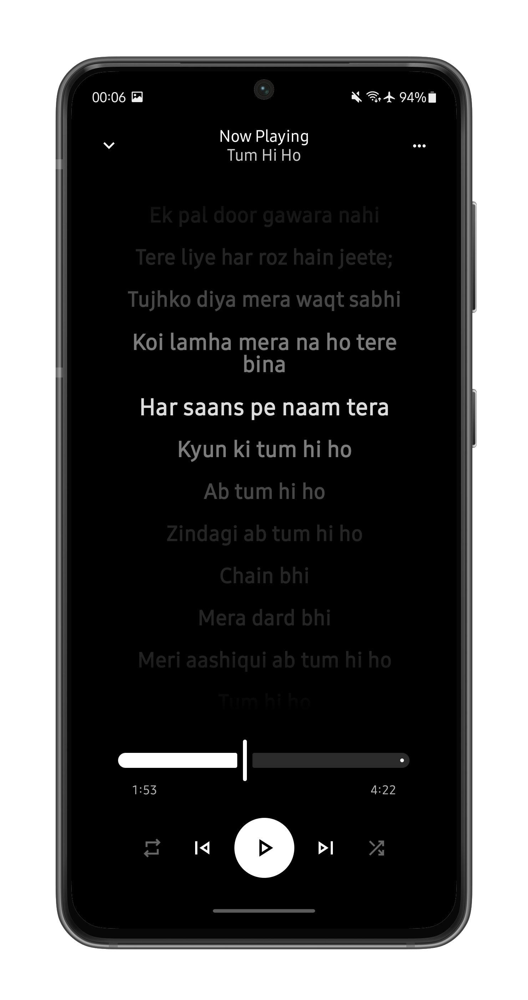

<div align="center">
  
</div>

<div align="center">
  <h1>Echo Music</h1>
  <h3>A Modern, Feature-Rich Music Streaming App for Android</h3>
  <p>Stream music from YouTube Music and Spotify with AI-powered song suggestions, synced lyrics, and offline playback.</p>
  <p><strong>Current Version: v1.8.0</strong></p>
</div>

<div align="center">
  <a href="https://github.com/iad1tya/Echo-Music/releases/latest">
    
  </a>
  <a href="https://github.com/iad1tya/Echo-Music/issues">
    
  </a>
  <a href="https://github.com/iad1tya/Echo-Music/blob/main/LICENSE">
    
  </a>
</div>

---

## Screenshots

<div align="center">
  
  
  
  
</div>

---

## Key Features

### Music Streaming

* **YouTube Music and Spotify Integration:** Stream music seamlessly from both platforms.
* **Video/Audio Playback:** Switch effortlessly between video and audio modes.
* **Background Playback:** Continue listening while using other apps.
* **Offline Playback:** Download songs for offline listening.
* **High-Quality Audio:** Supports multiple audio formats and bit-perfect USB DAC playback.

### User Experience

* **Modern Interface:** Developed with Jetpack Compose and Material Design 3.
* **Dark Mode:** Includes Material You dynamic theming.
* **Multi-language Support:** Available in over 20 languages.
* **Customizable Interface:** Adjust colors, layouts, and appearance.

### Discovery and Search

* **Smart Search:** Search across YouTube and Spotify simultaneously.
* **AI Recommendations:** Personalized song suggestions based on your listening habits.
* **Browsing:** Explore curated categories such as Home, Charts, Podcasts, Moods, and Genres.
* **Recently Played:** Access your recent tracks instantly.

### Advanced Features

* **Synced Lyrics:** Real-time lyric display with translation support.
* **Playlist Management:** Create, edit, sync, and organize playlists with intuitive long-press actions.
* **Sleep Timer:** Automatically stop playback after a set duration.
* **Widgets:** Quick access from your home screen.
* **Firebase Integration:** Optional analytics and crash reporting for improved app stability.

---

## Installation

### Option 1: Download Pre-Built APK

1. Visit the [Releases Page](https://github.com/iad1tya/Echo-Music/releases/latest).
2. Download the latest APK file.
3. Install it on your Android device.

### Option 2: Build from Source

1. **Clone the Repository**

   ```bash
   git clone https://github.com/iad1tya/Echo-Music.git
   cd Echo-Music
   ```

2. **Configure Android SDK**

   ```bash
   cp local.properties.template local.properties
   ```

   Update `local.properties` with your Android SDK path:

   ```properties
   sdk.dir=/path/to/your/android/sdk
   ```

3. **Optional: Configure Firebase**

   ```bash
   cp app/google-services.json.template app/google-services.json
   ```

   Replace placeholders with your Firebase project credentials.

4. **Build the Project**

   ```bash
   ./gradlew assembleFossDebug
   ```

---

## Contributing

We welcome community contributions.

1. **Fork** the repository.
2. **Create a feature branch:**

   ```bash
   git checkout -b feature/new-feature
   ```
3. **Implement your changes** following our coding guidelines.
4. **Run tests:**

   ```bash
   ./gradlew test
   ```
5. **Commit and push:**

   ```bash
   git commit -m "Add new feature"
   git push origin feature/new-feature
   ```
6. **Open a Pull Request** on GitHub.

### Development Guidelines

* Follow Kotlin best practices.
* Write clear and meaningful commit messages.
* Include tests for new functionality.
* Update relevant documentation.

---

## License

This project is licensed under the **GNU General Public License v3.0 (GPL-3.0)**.
See the [LICENSE](LICENSE) file for details.

---

## Privacy

Echo Music is designed with user privacy in mind:

* **Analytics:** Optional and disabled by default.
* **Crash Reports:** Optional and disabled by default.
* **Personal Data:** No personal information is collected without consent.

---

## Support

* **Report Issues or Request Features:** [GitHub Issues](https://github.com/iad1tya/Echo-Music/issues)
* **Join Discussions:** [GitHub Discussions](https://github.com/iad1tya/Echo-Music/discussions)
* **Additional Documentation:**
  [SETUP.md](SETUP.md) | [CONTRIBUTING.md](CONTRIBUTING.md) | [TROUBLESHOOTING.md](TROUBLESHOOTING.md)

---

## Support the Project

<div align="center">
  <a href="https://buymeacoffee.com/iad1tya">
    
  </a>
  <a href="https://discord.gg/eNFNHaWN97">
    
  </a>
</div>

---

<div align="center">
  <p>Contact: <a href="mailto:hello@echomusic.fun">hello@echomusic.fun</a></p>
</div>
